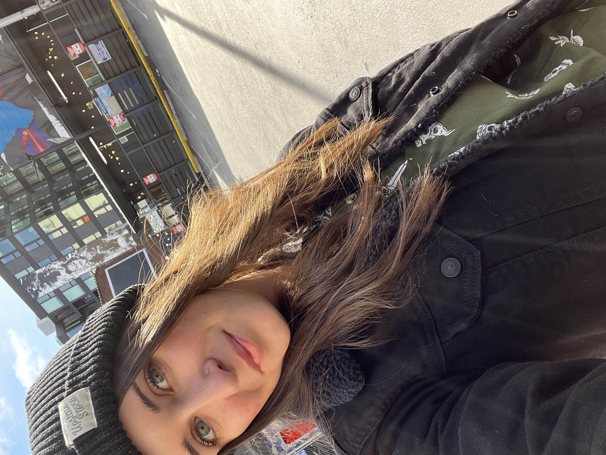

# portfoio-prep

## Creating Content...

* A two or three word catchy title. Do NOT use cliches like “programming ninja” or “coding rockstar”.
		** I Make Websites!
		and also other things :)

* A personal headline, like you have atop your LinkedIn page. What do you want your career to be about?
		** Here for creative collaborations and takling coding challenges head-on!

* Your professional pitch: You’ve done a recording, so just write down here how it goes.
		** Software-developer-in-training with experience in HTML, CSS, and JavaScript. Professional experience and leadership skills acquired serving active duty in the United States Navy and as Associate Team Lead in Customer Service at Whole Foods Market. I am a team player, a creative, a problem solver, and a “pleasure to have in class” according to my kindergarten teacher, Miss Stone. I’m assuming this still holds true.
		** I am excited to start an exciting and fulfilling new career path in tech and contribute to innovative new projects.

* What excites you the most about tech? Write 1-2 sentences.
		** The tech world offers the opportunity for creative problem solving and exciting collaboration with other creative folk, and I can't wait to be a part of that world, à la Little Mermaid.

## Gathering Assets...

* 

* 

* 

* 

* 

* 

* 

* 

* 

* 

* 

* 

* 

* 

* 

* 